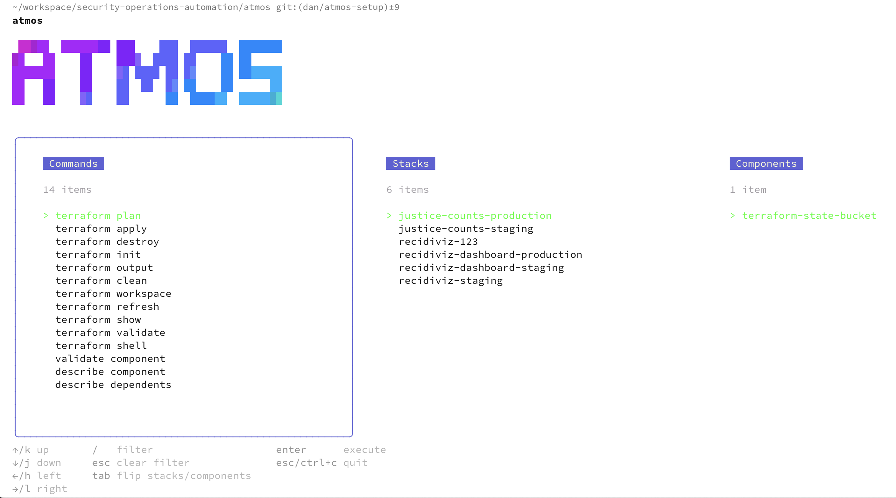

# `atmos` Terraform IaC

[Atmos](https://atmos.tools/introduction/) tooling organizes vanilla Terraform configuration into smaller components and handles generating a Terraform graph through a simple deep-merge of YAML into Terraform variables

> All that Atmos does is deep-merge the variables from the stack configurations and produce a single "var file" that we pass to the `terraform plan`. There's very little magic, which is how to ensure future compatibility with Terraform and interoperability with the entire Terraform ecosystem.

The main benefit of Atmos for us would be in its organizational guidance. It breaks up Terraform configuration into three concepts:

- **Components:** The base building block of IaC configuration. These are Terraform root modules that contain resources that are tightly coupled and likely to change together.
- **Catalogs:** Catalogs contain configuration for components, used when:
    - You have many components that are provisioned in multiple stacks (many OUs, accounts, regions) with different configurations for each stack
    - You need to make the components' default configurations reusable across different stacks
    - You want the component catalog folders structures to mirror the Terraform components folder structure to make it easy to find and manage
    - You want to keep the configurations [**DRY**](https://en.wikipedia.org/wiki/Don%27t_repeat_yourself)
- **Stacks:** Stacks are made up of instantiations of components and represent different environments. For example, staging and production, or even entirely separate projects for monorepo setup.

## Deploying infrastructure with `atmos`
Running the `atmos` command will bring up a friendly interface which can be used to deploy components.

You can access the atmos CLI shell by running:
```bash
nx run atmos:cli
```

To run custom `atmos` commands, launch the container by running:
```bash
nx run atmos:shell
```

To download the latest set of vendored components, run the following:
```bash
nx run atmos:vendor-pull --github-token=$(gh auth token)
# Target a specific component
nx run atmos:vendor-pull --github-token=$(gh auth token) -c cloud-sql-instance
```



The `atmos` CLI supports all `terraform` commands by prefixing them with `atmos`. A component and stage must be specified for all commands.
For example:
```bash
# Create a terraform plan for a component
atmos terraform plan \
	# The component that we're managing
	terraform-state-bucket \
	# The stage who's Terraform state we're importing the resource to
	-s recidiviz-dashboard-production

# Import an existing resource into a stack component's state
atmos terraform import \
	# The component that we're managing
	terraform-state-bucket \
	# The stage who's Terraform state we're importing the resource to
	-s recidiviz-dashboard-production \
	# Specify the address of the resource as it exists within the component
	google_storage_bucket.bucket \
	# Specify the GCP identifier of the resource
	recidiviz-dashboard-production-tf-state

```
## Atmos installation
Atmos can be installed locally via `brew install atmos` or you can use our `atmos-runner` docker image

## Using `docker compose`
The `atmos-shell` service provides an environment for running our atmos scripts, or the atmos cli directly.
```bash
docker compose -f docker-compose.yaml run --remove-orphans atmos-shell
nx run atmos:
```

