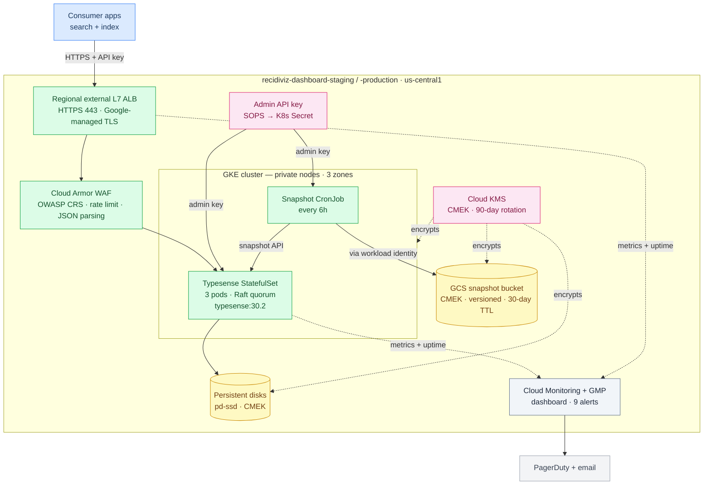

# typesense

Self-managed [Typesense](https://typesense.org) search cluster on GKE, deployed via the
[Typesense Kubernetes Operator (TyKO)](https://github.com/akyriako/typesense-operator).

One regional GKE Standard cluster per environment (`us-central1`), running a 3-node Typesense Raft
quorum (one pod per zone) with CMEK throughout, exposed publicly through a **regional** external
Application LB with regional Cloud Armor + a regional Google-managed TLS cert, and monitored for
downtime.

Each environment can optionally run a second instance of this component in a fallback region as a
`mode = "standby"` deployment — pre-provisioning the slow-to-create supporting infra (regional IP, KMS,
snapshot bucket, cert DNS authorization, snapshotter GSA) so a regional-DR cutover is a stack-file
flip + apply + DNS swap rather than a from-scratch rebuild. See `RUNBOOK.md` → "Regional outages".

**On-call:** see [RUNBOOK.md](./RUNBOOK.md) for the dashboard + alert-policy triage guide.
**Disaster Recovery:** See [Recovery Scenarios in ./RUNBOOK.md](./RUNBOOK.md#recovery-scenarios)

## What this component creates

- **Regional GKE Standard cluster** (`cluster.tf`) — Stable channel, Workload Identity, Gateway API, Managed Prometheus, off-peak maintenance.
- **CMEK** (`kms.tf`, `dr.tf`) — regional key ring for etcd / node disks / data PD; separate multi-region `us` key ring for the snapshot bucket.
- **Cloud NAT** (`network.tf`) — egress for private nodes.
- **TyKO + `TypesenseCluster` CR** (`operator.tf`, `typesense.tf`) — 3-node Raft quorum, one pod per zone, `minAvailable: 2` PDB, CMEK `pd-ssd` `StorageClass`, admin API key from SOPS, healthcheck sidecar.
- **Regional exposure** (`exposure.tf`, `typesense.tf`) — regional IP + Cloud Armor (OWASP CRS + rate-limit) + Certificate Manager managed cert + GKE Gateway.
- **Snapshots** (`dr.tf`) — every 6h, leader Raft snapshot → CMEK GCS bucket in multi-region `US` (readable through a regional outage). Daily RocksDB compaction CronJob alongside.
- **Monitoring** — alerts + dashboard in Cloud Monitoring. See [RUNBOOK.md](./RUNBOOK.md).

**DNS is external** — no Cloud DNS zone here. After apply, publish in recidiviz.org: (1) A record for the hostname → `endpoint_ip` output, (2) cert-validation CNAME from `cert_dns_authorization_record` output. The cert stays in PROVISIONING until the CNAME resolves.



## Secrets (SOPS)

Provide `secrets/<project_id>.enc.yaml` for each project — `recidiviz-dashboard-staging.enc.yaml` and
`recidiviz-dashboard-production.enc.yaml` — containing:

```yaml
typesense_admin_api_key: <random-string> # bootstrap admin key
```

Create one (the `*.enc.yaml` rule in `libs/atmos/.sops.yaml` selects the `pulse-dashboards-sops` key):

```bash
cd libs/atmos/components/terraform/apps/typesense
cat > secrets/recidiviz-dashboard-staging.enc.yaml <<EOF
typesense_admin_api_key: $(openssl rand -hex 32)
EOF
sops --encrypt --in-place secrets/recidiviz-dashboard-staging.enc.yaml
```

Commit the encrypted files; never commit plaintext.

## Deploy

This component is applied in **two phases**. The `kubernetes`/`helm`/`kubectl` providers are configured
from `google_container_cluster.primary.endpoint`; on the apply that first creates (or replaces) the
cluster, that endpoint is unknown at plan time, so those providers fall back to `localhost` and the
Kubernetes-layer resources fail with `dial tcp [::1]:80: connect: connection refused`. So:

```bash
# Phase 1 — create just the cluster + node pool (so the Kubernetes control plane endpoint becomes known):
atmos terraform apply apps/typesense --stack recidiviz-dashboard-staging--typesense \
  -- -target=google_container_cluster.primary -target=google_container_node_pool.primary_nodes

# Phase 2 — apply the rest (operator, TypesenseCluster CR, exposure, monitoring):
atmos terraform apply apps/typesense --stack recidiviz-dashboard-staging--typesense
```

(If you ran a single apply and it failed at the first `kubernetes_*` resource with the `localhost` error,
the cluster still came up — just re-run phase 2.) Within phase 2, `depends_on` orders namespace →
`helm_release` (operator, installs the CRD) → `TypesenseCluster` CR. Repeat for the production stack. The
managed TLS cert stays in `PROVISIONING` until the external DNS A + authorization records resolve.

### The `--secondary` component instance (standby tier)

Both stacks declare a **second instance** of this same Terraform component, named
`apps/typesense--secondary`, in `mode: standby`.

Those instances get their own Terraform state (workspace `…-apps-typesense--secondary`) and create a
parallel set of supporting infra in the fallback region.

See `RUNBOOK.md` → "Regional outages" for the failover procedure.

## VERIFY against the installed operator

Several fields depend on the exact pinned `operator_chart_version`. After the first apply, confirm and
reconcile the items marked `VERIFY` in `typesense.tf`:

```bash
kubectl get crd | grep -i typesensecluster          # CRD apiVersion (ts.opentelekomcloud.com vs typesense.io)
kubectl explain typesensecluster.spec               # spec field names (adminApiKey, storage, httpRoutes, healthCheck, ...)
kubectl -n typesense get svc,pods --show-labels   # Service name + pod labels (PDB / policies / exporter target these)
```

Also confirm, for the pinned chart version:

- whether TyKO already manages a Pod Disruption Budget or a quorum-aware readiness probe (to avoid conflicting with the ones
  defined here);
- the `spec.healthCheck` field casing and that the sidecar serves `/readyz` on **8808**, reachable at the
  Service host used in `metrics.tf` (`local.typesense_svc_host`) — adjust `TYPESENSE_HOST` / the blackbox
  `target` if the Service name or exposed ports differ;
- whether `/readyz` returns HTTP 503 when unhealthy (the blackbox `http_2xx` module assumes so) or always
  200 with the health in the body — in the latter case add a custom blackbox module (ConfigMap) with
  `fail_if_body_not_matches_regexp`.

## Verify the deployment

```bash
gcloud container clusters describe typesense-us-central1 --region us-central1 \
  --format='value(databaseEncryption.state, releaseChannel.channel)'      # ENCRYPTED, STABLE
# Configure kubectl credentials (regional cluster — use --region, not --zone):
# gcloud container clusters get-credentials typesense-us-central1 --region us-central1 --project recidiviz-dashboard-staging
kubectl -n typesense get typesensecluster                                  # QuorumReady
kubectl -n typesense get pods -o wide                                      # 3 pods, one per zone
kubectl -n typesense get pdb                                               # minAvailable: 2
curl https://<hostname>/health                                             # {"ok":true}

# Metrics → Cloud Monitoring
kubectl -n typesense get podmonitoring                                     # typesense-sidecar, typesense-healthcheck-probe
kubectl -n typesense get pods -l app=typesense-sts                         # 3 pods, each w/ metrics-exporter sidecar (port 9100)
kubectl -n typesense get pods -l app=blackbox-exporter                     # Running (healthcheck /readyz probe)
# Then in Metrics Explorer (PromQL): typesense_metrics_memory_active_bytes (per pod) and probe_success
```

The resource/quorum alert policies and the dashboard are already in `monitoring.tf` / `dashboard.tf` and
apply in the normal `atmos terraform deploy` (the metric descriptors already exist). Open the dashboard via
the `dashboard_url` output, and confirm the alert policies under Cloud Monitoring → Alerting.
